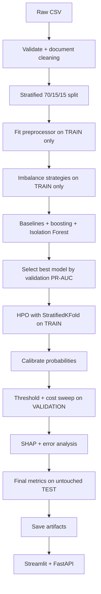
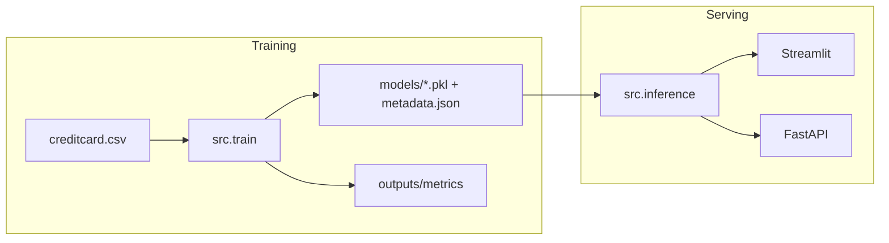

# Credit Card Fraud Detection

Production-style machine learning system that scores a credit-card transaction as **legitimate** or **fraudulent**, then returns a calibrated-style probability, a risk band, and SHAP feature contributions.

This is not a single-classifier notebook. It is a leakage-safe, modular pipeline: stratified splits, training-only preprocessing and resampling, validation-only threshold tuning, held-out test reporting, cost-sensitive operating points, and deployable Streamlit + FastAPI services.

---

## 1. Problem Statement

Card issuers must detect fraudulent transactions in a stream where fraud is extremely rare (~0.17% of transactions). A model that always predicts “legitimate” is about **99.83% accurate** and catches **zero fraud**. The system therefore optimizes **PR-AUC**, **recall**, **precision**, and **F1**, not accuracy, and it chooses a decision threshold from business cost — not the default 0.5 cutoff.

**Outputs for one transaction**

| Field | Meaning |
| --- | --- |
| `fraud_probability` | Model score in \([0, 1]\) |
| `prediction` | `FRAUD` or `LEGITIMATE` at the tuned threshold |
| `risk_level` | `LOW` / `MEDIUM` / `HIGH` |
| `threshold` | Operating cutoff chosen on validation data |
| `top_features` | SHAP contributors |
| `model_confidence` | Distance from the opposite class (`p` or `1-p`) |

```text
Transaction → Preprocessing → Model → Fraud probability
                                      → Prediction + risk band
                                      → SHAP explanation
```

## 2. Business Motivation

- **False negative (missed fraud):** chargeback, customer harm, regulatory exposure. High cost.
- **False positive (false alert):** analyst review time and possible card friction. Lower cost, but not free.

The pipeline prices those errors explicitly:

```text
Expected cost = FN × fraud_miss_cost + FP × false_alert_cost
```

Default relative costs are `500` (missed fraud) vs `5` (false alert). Thresholds are swept on **validation** data; the test set is not used to pick a cutoff.

## 3. Dataset

[Credit Card Fraud Detection](https://www.kaggle.com/datasets/mlg-ulb/creditcardfraud) (Worldline / ULB Machine Learning Group). Transactions by European cardholders over two days in September 2013.

The raw CSV is **not committed**. Kaggle / dataset terms do not allow redistributing the file. Download it locally:

```bash
python scripts/download_data.py
# or copy your Kaggle CSV to data/raw/creditcard.csv
```

Download order: local `--source` path → KaggleHub / Kaggle API → [TensorFlow public mirror](https://storage.googleapis.com/download.tensorflow.org/data/creditcard.csv) of the same file.

## 4. Data Characteristics

| Property | Typical value |
| --- | --- |
| Rows | ~284,807 |
| Fraudulent | ~492 (~0.172%) |
| Features | `Time`, `V1`–`V28` (PCA), `Amount` |
| Target | `Class` (0 = legitimate, 1 = fraud) |
| Missing values | None in the public file |
| Leakage risk | High if you scale / SMOTE / tune thresholds before splitting |

PCA features `V1`–`V28` were anonymized by the data owners. `Time` is seconds from the first transaction, not a wall-clock timestamp.

## 5. ML Pipeline



## 6. Data Preprocessing

Documented in `outputs/metrics/preprocessing_decisions.json` after training.

| Step | Decision |
| --- | --- |
| Exact duplicate rows | Dropped (identity, not a learned statistic) |
| Non-finite values | Dropped |
| Statistical outliers | **Kept** — fraud often lives in the tails |
| Feature engineering | `Amount_log`, `Hour`, `Hour_sin`, `Hour_cos` |
| Scaling | `StandardScaler` on Time/Amount-derived columns, **train-fit only** |
| PCA columns | Passed through (already transformed by the data owners) |

## 7. Class Imbalance Strategy

Accuracy is the wrong headline metric: the negative class is 99.83% of the data.

Compared **on training data only**, then scored on the real-world validation prior:

1. No resampling + `class_weight` / `scale_pos_weight`
2. Random under-sampling
3. Random over-sampling
4. SMOTE
5. SMOTE + Tomek Links

SMOTE is **never** applied before the split, and **never** applied to validation or test.

## 8. Models

**Baselines:** Logistic Regression, Decision Tree, Random Forest (`class_weight='balanced'`).

**Boosting:** XGBoost (`scale_pos_weight`), LightGBM (`scale_pos_weight`), CatBoost (`auto_class_weights='Balanced'`), HistGradientBoostingClassifier.

**Anomaly detection:** Isolation Forest (fit on legitimate training rows) and a lightweight MLP autoencoder (reconstruction error). Unsupervised scores are reported for comparison; production selection is restricted to supervised models.

## 9. Hyperparameter Optimization

- **Optuna** maximizes StratifiedKFold **PR-AUC on training data** for the winning booster.
- **RandomizedSearchCV** is used for Random Forest (and as an Optuna fallback).
- Validation data is used only to **report** the post-HPO PR-AUC, not as the Optuna objective.
- Accuracy is not an optimization target.

## 10. Threshold Optimization

Probability `> 0.5` is not the default operating point.

Thresholds `{0.05, 0.10, …, 0.90}` are evaluated on **validation** predictions. The default policy minimizes expected cost among cutoffs with recall ≥ 0.80 (configurable). Precision, recall, F1, and cost are all written to `outputs/metrics/val_threshold_sweep.csv`.

## 11. Evaluation

Primary metrics: **PR-AUC**, **recall**, **precision**, **F1**.

Also reported: accuracy, macro-F1, ROC-AUC, specificity, FPR, FNR, Brier score, confusion matrix.

**Why PR-AUC:** ROC-AUC can look strong when true negatives are easy. PR-AUC is the area under precision vs recall and is dominated by how the model ranks the rare fraud class.

## 12. SHAP Explainability

For the production tree model the pipeline writes:

- Global bar plot (`outputs/figures/shap_bar.png`)
- Beeswarm plot (`outputs/figures/shap_beeswarm.png`)
- Per-transaction top positive / negative contributors in the API and Streamlit app

Example shape of an explanation (illustrative, not a claimed result):

```text
Fraud probability: 0.962
V14 → increases fraud probability
V10 → increases fraud probability
Amount_log → moderate contribution
```

## 13. Error Analysis

After the test evaluation the pipeline inspects false positives, false negatives, high-confidence mistakes, and low-confidence scores, and writes `outputs/metrics/test_error_analysis.json` plus `outputs/figures/test_error_analysis.png`.

Typical pattern on this dataset: missed frauds often have PCA signatures closer to the legitimate bulk; false positives are the review-queue cost of a high-recall policy.

## 14. Deployment

| Interface | Command |
| --- | --- |
| Streamlit dashboard | `streamlit run app/app.py` |
| FastAPI | `uvicorn app.api:app --reload --port 8000` |
| Single-call Python | `from src.inference import predict_transaction` |

The dashboard supports manual feature entry, CSV batch scoring, session history, SHAP plots, and summary charts (fraud vs legit, risk mix, probability histogram).

## 15. API

```http
GET  /health
GET  /model-info
POST /predict
POST /predict/batch
```

`POST /predict` body: `Time`, `Amount`, `V1`–`V28`.  
Response: `fraud_probability`, `prediction`, `risk_level`, `threshold`, `top_features`, `model_confidence`.

## 16. Project Architecture

```text
creditcard_fraud/
├── app/                 # Streamlit UI + FastAPI
├── configs/             # YAML defaults
├── data/                # raw/processed (CSV gitignored)
├── models/              # joblib artifacts (gitignored)
├── notebooks/           # EDA notebook
├── outputs/             # figures, metrics, predictions
├── scripts/             # dataset download
├── src/                 # modular pipeline
├── tests/               # pytest
├── train.py             # CLI entry point
└── Dockerfile
```



## 17. Results

Metrics below are **copied from a real `python train.py` run**. They are not placeholders invented by hand. Source of truth: `outputs/metrics/final_report.json` and `outputs/metrics/model_comparison.csv`.

<!-- METRICS:START -->
**Production model:** `xgboost`  
**Operating threshold:** `0.050`  
**Why this threshold:** Selected to minimize expected cost among thresholds with recall >= 0.80. Missed fraud (FN) is priced at a much higher cost than a false alert (FP), matching a banking review workflow.

These numbers come from `outputs/metrics/final_report.json` after `python train.py`. They are not hardcoded.

### Held-out test set (untouched until final evaluation)

| Metric | Test |
| --- | ---: |
| PR-AUC | 0.8336 |
| Recall | 0.8169 |
| Precision | 0.7733 |
| F1 | 0.7945 |
| ROC-AUC | 0.9736 |
| Accuracy | 0.9993 |
| Brier | 0.0004 |
| Specificity | 0.9996 |

Confusion matrix on test: TP=58, FP=17, TN=42471, FN=13.

Validation (threshold / model choice only): PR-AUC **0.8558**, F1 **0.8286**, recall **0.8169**, precision **0.8406**.

Cross-validation on train: **0.8612 ± 0.0064 (PR-AUC, 3 folds)**

Split sizes: train 198608 (fraud 331), val 42559 (fraud 71), test 42559 (fraud 71).

HPO: Optuna / RandomizedSearchCV on **training folds only**; post-HPO validation PR-AUC **0.8558**. Isotonic calibration was evaluated and **not** used (`used_calibration=False`): raw Brier 0.00036610939423553646, calibrated Brier 0.00042535467018282885.

Cost framework: FN=500.0, FP=5.0, validation expected cost **6555.0**.

Test error analysis: FP=17, FN=13. Missed frauds (FN=13) have mean amount 214.13 and mean predicted probability 0.004. These are typically frauds whose PCA signature is closer to the legitimate bulk. False alerts (FP=17) have mean amount 146.84 and mean probability 0.355. In production these would enter a human review queue rather than an auto-block.

The comparison table below is **validation performance at probability 0.5**, used only to rank models. Production uses the cost-sensitive threshold above; the test table is the honest final score.

### Validation comparison (threshold = 0.5)

| model | precision | recall | f1 | roc_auc | pr_auc | inference_seconds |
| --- | --- | --- | --- | --- | --- | --- |
| logistic_regression | 0.0512 | 0.8873 | 0.0968 | 0.9698 | 0.7133 | 0.0018 |
| decision_tree | 0.1091 | 0.7746 | 0.1913 | 0.8482 | 0.4935 | 0.0027 |
| random_forest | 0.8571 | 0.7606 | 0.8060 | 0.9791 | 0.8330 | 0.0539 |
| xgboost | 0.9180 | 0.7887 | 0.8485 | 0.9757 | 0.8484 | 0.0123 |
| lightgbm | 0.7895 | 0.6338 | 0.7031 | 0.8373 | 0.6355 | 0.0344 |
| catboost | 0.8769 | 0.8028 | 0.8382 | 0.9626 | 0.8264 | 0.0078 |
| hist_gradient_boosting | 0.3548 | 0.7746 | 0.4867 | 0.9697 | 0.7127 | 0.0110 |
| isolation_forest | 0.0031 | 0.9437 | 0.0063 | 0.9350 | 0.0828 | 0.2018 |
| autoencoder | 0.0032 | 0.9577 | 0.0064 | 0.9470 | 0.2841 | 0.0151 |

### Imbalance strategies (LightGBM probe, training-only resampling)

| strategy | pr_auc | recall | precision | f1 |
| --- | --- | --- | --- | --- |
| class_weight | 0.6355 | 0.6338 | 0.7895 | 0.7031 |
| random_under | 0.7139 | 0.8732 | 0.2305 | 0.3647 |
| random_over | 0.8280 | 0.7746 | 0.8594 | 0.8148 |
| smote | 0.7908 | 0.8028 | 0.6951 | 0.7451 |
| smote_tomek | 0.8333 | 0.8310 | 0.6020 | 0.6982 |
<!-- METRICS:END -->

## 18. Installation

Python 3.10+ (3.11 recommended).

```bash
python3.11 -m venv .venv
source .venv/bin/activate
pip install -r requirements.txt
python scripts/download_data.py
```

On macOS, LightGBM needs the OpenMP runtime (`brew install libomp`). The formula is keg-only; the pip wheel looks for `/opt/homebrew/opt/libomp/lib/libomp.dylib`.

The Linux Docker image installs `libgomp1` for the same reason.

## 19. Usage

```bash
# Full leakage-safe pipeline (EDA, models, HPO, threshold, SHAP, test report)
python train.py --download

# Laptop-faster run (fewer trees / trials; still real metrics)
python train.py --fast

# Inference
python -c "from src.inference import predict_transaction; print(predict_transaction({...}))"

streamlit run app/app.py
uvicorn app.api:app --host 0.0.0.0 --port 8000

pytest
```

Saved artifacts:

- `models/best_model.pkl`
- `models/preprocessor.pkl`
- `models/metadata.json` (threshold, feature names, risk bands)
- `models/config.json`

## 20. Docker

```bash
docker build -t fraud-detection .
docker run --rm -p 8501:8501 fraud-detection
docker run --rm -p 8000:8000 -e APP_MODE=api fraud-detection
```

Train **on the host** first so `models/` contains artifacts, or mount them:

```bash
docker run --rm -p 8501:8501 -v "$(pwd)/models:/app/models" fraud-detection
```

## 21. Future Improvements

- Online learning / concept-drift monitors on `Time`-ordered windows
- Graph features (card–merchant–device) when raw identifiers are available
- Champion/challenger deployment with delayed fraud labels
- GPU LightGBM / XGBoost when a GPU is present
- Stronger autoencoder (PyTorch) if reconstruction error becomes a production signal

## Leakage and evaluation rules (enforced in code)

- Split **before** scaling, resampling, and threshold search
- Test data is scored **once**, after the operating threshold is frozen
- No SMOTE before `train_test_split`
- No accuracy-only model selection
- Random seed fixed (`42` by default)
- MLflow local tracking under `mlruns/` when the package is installed
